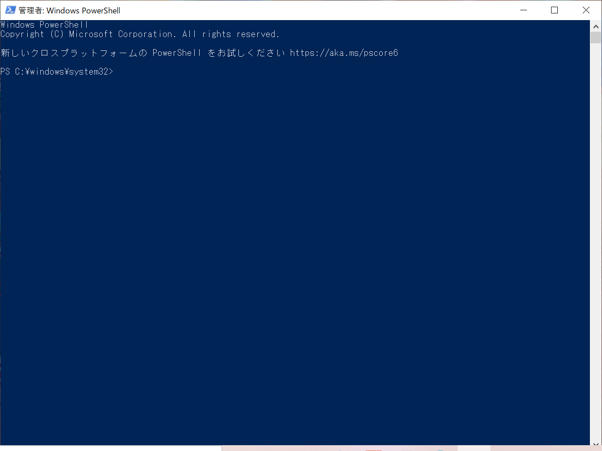
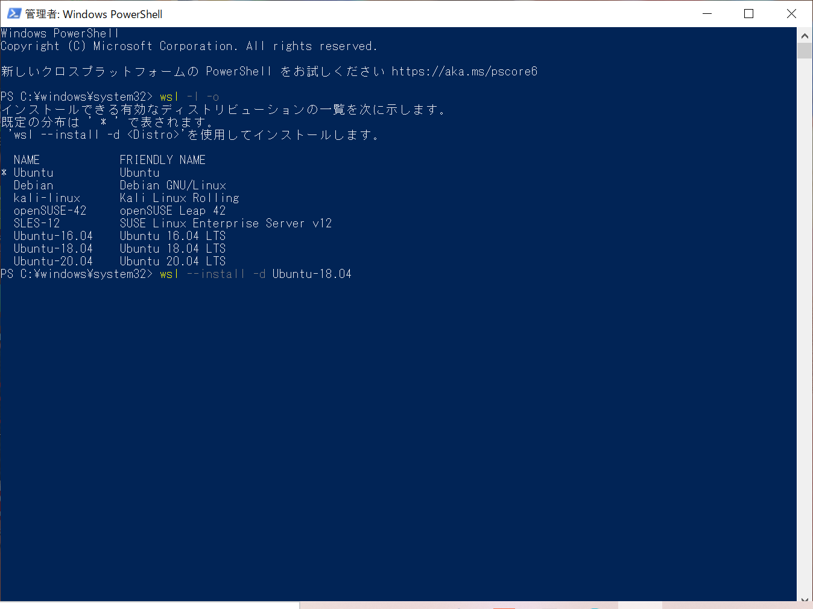
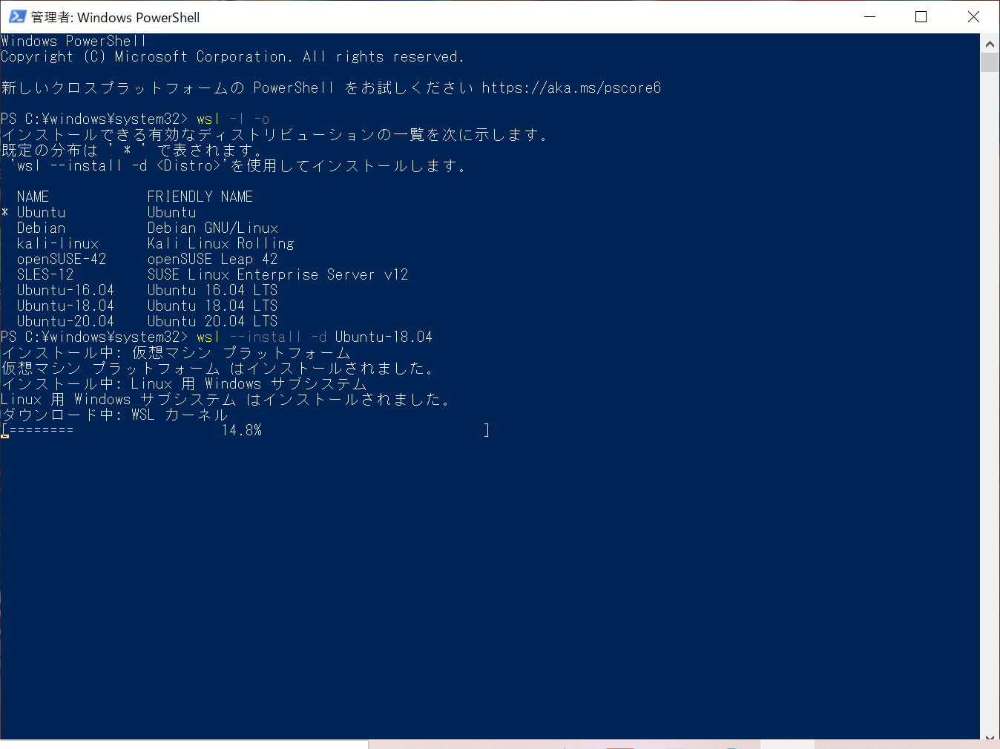
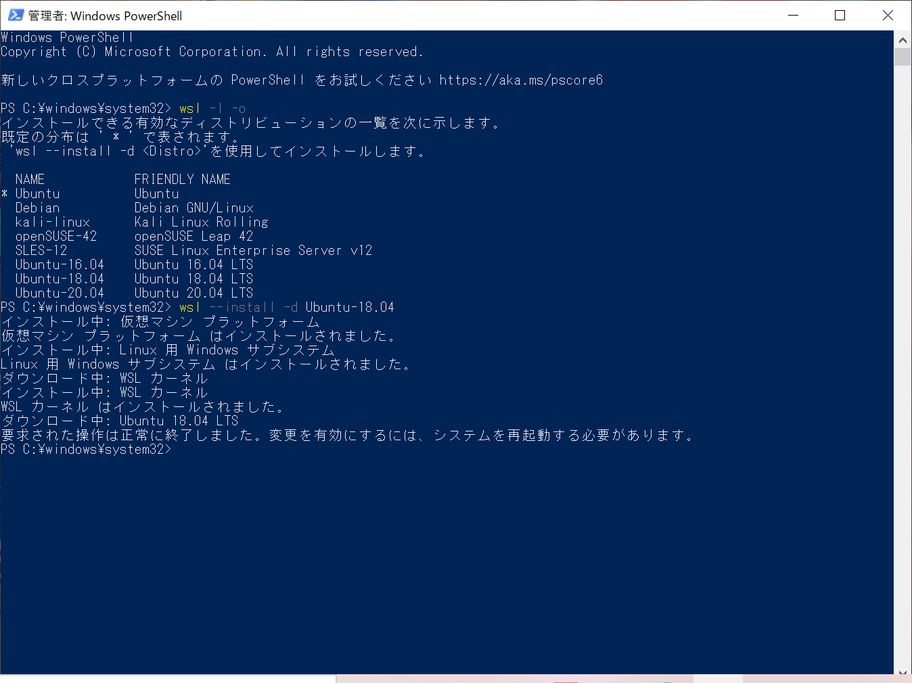

# WSL memorandum

## Environment

Windows11

## Setup

Powershellを使ってコマンドのみでインストール

### Install

1. `Powershell`を「管理者として実行」

1. `wsl -l -o`で利用可能なディストリビューション一覧を表示

1. `wsl --install -d {$distribution}`で`$distribution`をインストール

    ```powershell
    # 例 : Ubuntu 18.04 LTSをインストール
    wsl --install -d Ubuntu-18.04
    ```

    


1. PCを再起動


### Setting

1. あとは普通のLinux distributionsの扱い
    1. usernameを入力
    1. passwordを入力 (`passwd`コマンドで再設定可能)
    1. 必要なパッケージの取得 (任意)
        1. `sudo apt update`
        1. `sudo apt upgrade -y`
        1. `sudo apt install build-essential -y`
        1. HelloWorldへ

### VSCode

1. アドオン`Remote Development`をインストール
1. 画面左下緑のボタンから「WSLでフォルダを開く」ことが可能

## Network

### NameServer

1. うまくネットワークに接続できないとき

    1. DNSに問題がある場合
        1. `cat /etc/resolv.conf`
        1. `echo "nameserver 8.8.8.8" > /etc/resolv.conf`

    1. セキュリティソフトに問題がある場合

### Proxy

## SSH (Git/GitHub)

## Down grade to WSL1

## Reference
