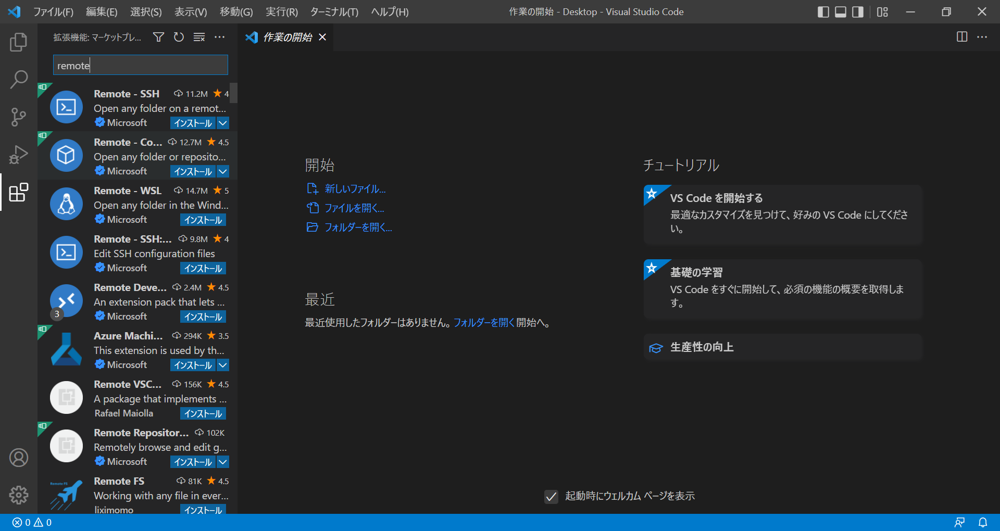
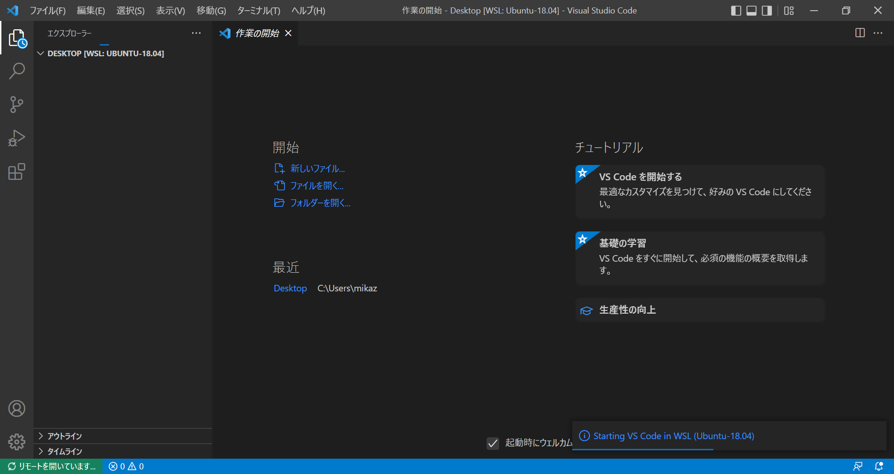

# WSL memorandum

## Theme

- Powershellを使ってコマンドのみでWSL環境構築
- なんも知らなくてもHelloWorldできるようになる

## Environment

Windows10 / Windows11

## Setup

### Install

1. `Powershell`を「管理者として実行」

    

1. `wsl -l -o`で利用可能なディストリビューション一覧を表示

    

1. `wsl --install -d {$distribution}`で`$distribution`をインストール

    ```powershell
    # 例 : Ubuntu 18.04 LTSをインストール
    wsl --install -d Ubuntu-18.04
    ```

    

1. PCを再起動

    

### Setting

あとは普通のLinux distributionsの扱い

1. usernameを入力
1. passwordを入力 (`passwd`コマンドで再設定可能)
1. 必要なパッケージの取得 (任意)
    1. `sudo apt update`
    1. `sudo apt upgrade -y`
    1. `sudo apt install build-essential -y`
    1. HelloWorldへ

### VSCode

1. アドオン`Remote Development`をインストール

    

1. 画面左下緑のボタンから「WSLでフォルダを開く」ことが可能

    

## Network

うまくネットワークに接続できないとき

1. DNSに問題がある場合

    ```bash
    sudo rm /etc/resolv.conf
    sudo sh -c "echo 'nameserver 8.8.8.8' > /etc/resolv.conf"
    ```

    [こちら](https://qiita.com/kkato233/items/1fc71bde5a6d94f1b982)より

    wslでは`/etc/resolv.conf`が自動生成され、nameserverが設定されるが、この設定が良くない場合がある(?)

1. セキュリティソフトに問題がある場合

    基本的にファイアウォールの設定が必要

    1. [McAfee-1](https://kcm.trellix.com/corporate/index?page=content&id=KB94601)
    1. [Symantec-1](https://teratail.com/questions/59081)
    1. [Symantec-2](https://kemasoft.net/?vm/wsl2%A4%C8SEP%A4%C8stone)
    1. [Symantec-3](https://jpdebug.com/p/2820485)

### VPN

mtuの設定

1. [mtu-1](https://blog.jicoman.info/2020/12/hangup-ssh-connection-using-wsl2/)
1. [mtu-2](https://zenn.dev/mallowlabs/articles/ssh-on-wsl2-with-vpn)
1. [mtu-3](https://pcvogel.sarakura.net/2020/03/22/32022)

### Proxy

1. [proxy-1](https://qiita.com/Gushi_maru/items/5ba23d997e32abc98620)
1. [proxy-2](https://yksnyh-lab.cyou/wsl2-develop-env/)

## SSH (Git/GitHub)

## Screen Output

wslから画面出力をするためのバーチャルな(?)モニターを用意する必要がある

1. [screen output-1](http://k28h.blogspot.com/2018/04/wsl-windowslinuxmatplotlib.html)
1. [screen output-2](https://ai-gaminglife.hatenablog.com/entry/2019/04/29/204841)
1. [screen output-3](https://qiita.com/ryoi084/items/c4339996c50c0cf39df4)
1. [screen output-4](https://koideforest.hatenadiary.com/entry/2019/06/10/101344)
1. [screen output-5](https://www.teamxeppet.com/xming1/)

## Downgrade to WSL1

```powershell
wsl --set-version {$distribution} 1
```

[こちら](https://yoshinorin.net/articles/2020/08/22/downgrade-wsl2-to-wsl1/)より

## Reference

1. <https://learn.microsoft.com/ja-jp/windows/wsl/install#manual-installation-steps>

1. <https://qiita.com/yo_kanyukari/items/37421f497b7ffaa75502>

1. <https://ntk-ta01.hatenablog.com/entry/2020/09/09/181155>

1. <https://qiita.com/2019Shun/items/5ab290a4117a00e373b6>

1. <https://qiita.com/kkato233/items/1fc71bde5a6d94f1b982>

1. <>
